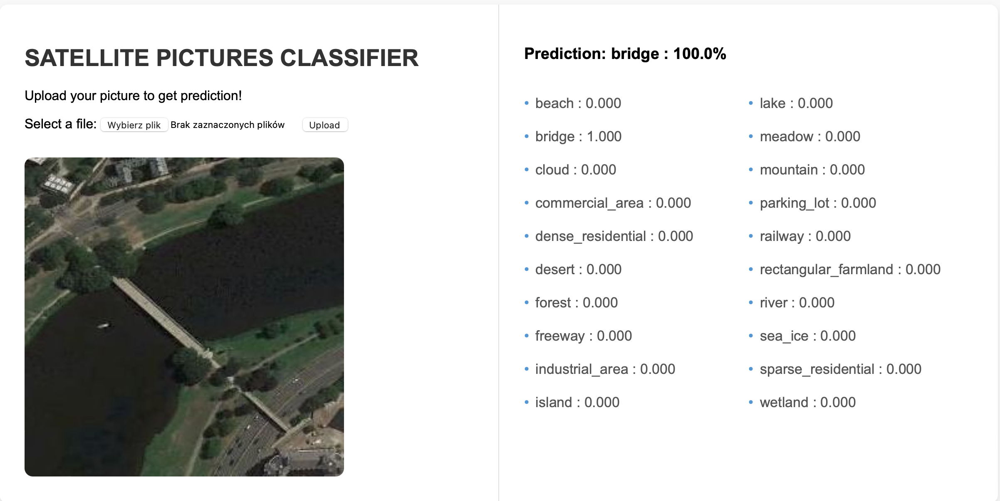

# Convolutional Neural Network Project

## Overview

This project focuses on Convolutional Neural Networks (CNNs), a type of deep learning model widely used for image recognition and computer vision tasks. The main objective of this project is to implement and train a CNN to achieve high accuracy in classifying images from a given dataset.

## Installation

1. Clone the repository to your local machine:

```bash
git clone https://github.com/kazkor/satelites-flask
cd satelites-flask
```

2. Set up a virtual environment (optional but recommended):

```bash
python -m venv venv
source venv/bin/activate  # On Windows: venv\Scripts\activate
```

3. Install dependencies

```bash
cd app
pip install -r requirements.txt
```

4. Run the web app

```bash
python app.py
```

## Dataset

The dataset was limited to a subset containing 20 classes from 45 provided. Every class has 700 pictures in 256x256 resolution (RGB). [https://www.tensorflow.org/datasets/catalog/resisc45](https://www.tensorflow.org/datasets/catalog/resisc45)

## Stack

## Stack

- **flask**: web app
- **tensorflow**: loading data, preprocessing data, cnn, callbacks.
- **matplotlib**: plotting pictures, losses and accuracies of the model.
- **seaborn**: confusion matrix heatmap.
- **numpy**: preparing test score to confusion matrix.
- **sklearn**: confusion matrix.
- **itertools**: preparation data to visualize the number of classes
- **PIL**: images


## Example




## About model

#### Training


#### Confussion Matrix


## TODO

** scale verification